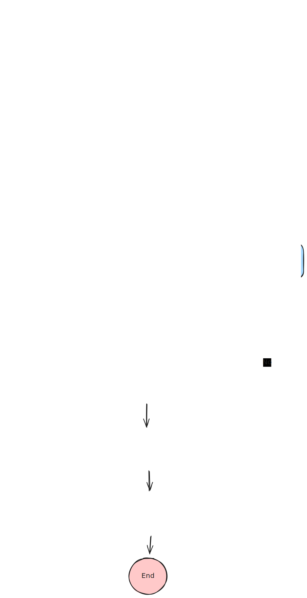

# FX Deals Data Warehouse

This project is part of a scrum team effort to develop a data warehouse for Bloomberg to analyze FX deals. The system accepts FX deal details from clients and persists them into a database.

## Initial Requirements

The project requirements are as follows:

- Accept FX deal details including:
    - Deal Unique Id
    - From Currency ISO Code (Ordering Currency)
    - To Currency ISO Code
    - Deal timestamp
    - Deal Amount in ordering currency
- Validate the structure of each deal.
- Prevent duplicate imports of the same deal.
- Implement a no rollback policy; every imported row must be saved in the database.
- Deliverables should include:
    - Use of an actual database (PostgreSQL in this case).
    - Dockerized deployment using Docker Compose.
    - Maven project structure for source code.
    - Proper error and exception handling.
    - Logging using Log4j.
    - Unit testing with sufficient coverage.
    - Markdown documentation (this README file).
    - Source code hosted on GitHub.
    - Optional: Makefile for streamlined application execution.

## Project Structure

The project follows a modular structure using Maven, organized into several modules:

- **app**: Contains the main Spring Boot application runner.
- **common**: Includes shared utilities and constants.
- **controller**: Manages REST API endpoints for dealing with FX deals.
- **repository**: Defines JPA repository interfaces for database interaction.
- **service**: Implements business logic services.
- **validation**: Provides deal validation logic.

## Technologies Used

- **Java 17**: Programming language used for development.
- **Spring Boot**: Framework for creating production-grade Spring-based applications.
- **PostgreSQL**: Database used for storing FX deals.
- **Docker**: Containerization technology for deployment.
- **JUnit 5 and Mockito**: Libraries for unit testing and mocking in Java.

## Installation and Setup

### Prerequisites

- Java 17
- Docker
- Maven

### Running the Application

1. Clone the repository from GitHub:
   ```bash
   git clone https://github.com/ZeyadAlQutaifan/fix-deals-task.git
   cd fix-deals-task

## Configuration

- **Database Configuration**: Check [docker-compose.yml](docker-compose.yml) for database settings.
- **Environment Variables**: Adjust settings like `SERVER_PORT`, `DATASOURCE_URL`, `DATASOURCE_USERNAME`, and `DATASOURCE_PASSWORD` in `docker-compose.yml` or directly in your environment.

## API Documentation

The API provides the following endpoint:

- **POST `/public/api/save/deals`**: Accepts a list of FX deals in JSON format. See the payload example and response format below.

### Request Payload Example

```json
[
    {
        "dealId": "34343",
        "fromCurrencyIsoCode": "JOD",
        "toCurrencyIsoCode": "AED",
        "dealAmount": 23
    },
    {
        "dealId": "344",
        "fromCurrencyIsoCode": "JOD",
        "toCurrencyIsoCode": "XYZ",
        "dealAmount": 30
    },
    {
        "dealId": "34343",
        "fromCurrencyIsoCode": "AED",
        "toCurrencyIsoCode": "USD",
        "dealAmount": 30
    }
]
```
### Response Example

```json
{
  "message": "OK",
  "unSavedDeals": [
    {
      "recordId": "344",
      "message": "To Currency ISO Code is invalid.",
      "unSaveReason": "INVALID"
    },
    {
      "recordId": "34343",
      "message": "Deal is duplicated",
      "unSaveReason": "DUPLICATE"
    }
  ],
  "savedDeals": [
    {
      "dealId": "34343",
      "fromCurrencyIsoCode": "JOD",
      "toCurrencyIsoCode": "AED",
      "dealAmount": 23
    }
  ]
}
```
### See

- [Postman Collection](fix-deals.postman_collection.json): Access the Postman collection for testing API endpoints.


## Project Workflow
Below is a flowchart illustrating the workflow of the `saveDeals` method in the application:



## Unit Testing

Unit tests have been implemented for critical components such as controllers, services, and validation logic using JUnit 5 and Mockito. Coverage is maintained at a satisfactory level to ensure reliability.

### FixDealsControllerTest

#### Patch Fix Deals

- **Scenario**: Contain Duplicate Deals
  - **Test Case**: Verifies that if duplicate deals are present, they are correctly identified and not saved.
  - **Result**: The API responds with a list of unsaved deals indicating duplicates.

- **Scenario**: All Deals Saved Successfully
  - **Test Case**: Ensures that when all deals are valid and unique, they are successfully saved.
  - **Result**: The API responds with a success message and lists all saved deals.

### FixDealsServiceImplTest

#### Save Deals

- **Scenario**: All Deals Saved Successfully
  - **Test Case**: Validates that when all input deals are valid and unique, they are saved without errors.
  - **Result**: The service returns a success response indicating all deals were saved.

- **Scenario**: Contain Duplicate Deals
  - **Test Case**: Tests the behavior when duplicate deals are encountered during saving.
  - **Result**: The service handles duplicates by marking them as unsaved and provides appropriate error messages.

- **Scenario**: Invalid Input Deals
  - **Test Case**: Checks how the service handles deals with missing or invalid data.
  - **Result**: Invalid deals are flagged as unsaved with corresponding error messages.

### DealInputValidatorTest

#### Validate Deal Input

- **Scenario**: Empty or Null Values
  - **Test Case**: Validates that empty or null values in deal attributes are rejected.
  - **Result**: The validator throws an `InvalidDealException` for each invalid input.

- **Scenario**: Deal Amount Validation
  - **Test Case**: Ensures that deal amounts below a certain threshold are rejected.
  - **Result**: Deals with insufficient amounts are considered invalid.

- **Scenario**: Valid Deal
  - **Test Case**: Checks the validation process for a correctly formatted and valid deal.
  - **Result**: The validator accepts the valid deal without exceptions.

## Deployment

### Docker Deployment

To deploy the FX deals application using Docker, follow these steps:

1. **Dockerfile**: Use the provided Dockerfile to build a Docker image for the application. This Dockerfile sets up the environment and copies the necessary files into the container.
2. **docker-compose.yml**: se Docker Compose to define and run multi-container Docker applications. It helps in setting up network configurations and managing multiple containers at once.
